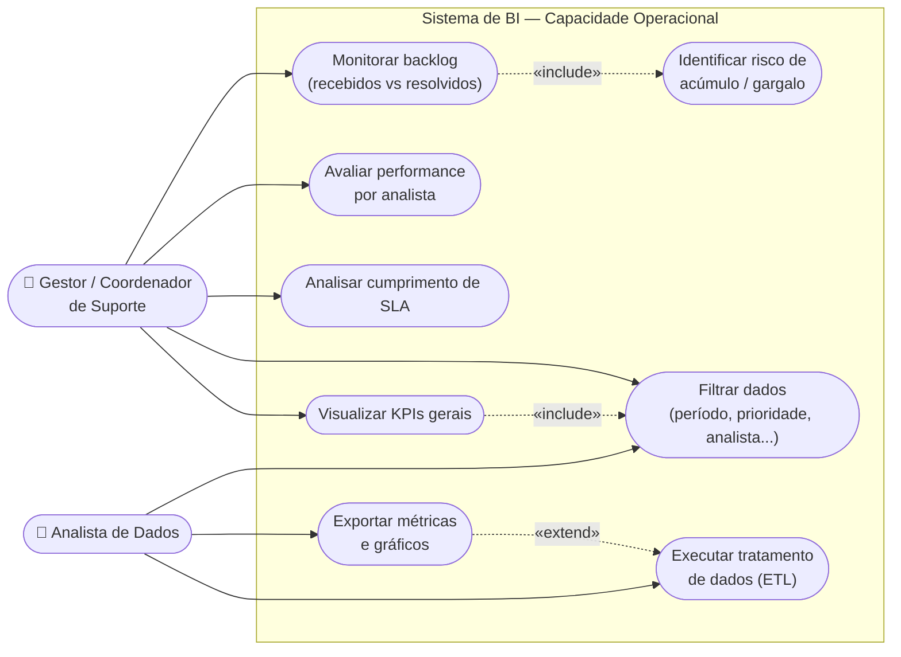

# Diagrama de Casos de Uso — Projeto Capacidade Operacional

Mostra como os **atores** interagem com o sistema de BI (dashboard de capacidade
operacional da equipe de suporte técnico).

- **Gestor / Coordenador de Suporte:** usa o dashboard para tomar decisões (SLA, equipe, backlog).
- **Analista de Dados:** mantém o pipeline (ETL) e gera as bases/relatórios.

## Especificação dos casos de uso

| ID | Caso de uso | Ator principal | Descrição |
|----|-------------|----------------|-----------|
| UC1 | Visualizar KPIs gerais | Gestor | Ver volume de tickets, TMR e satisfação na aba **Visão Geral**. |
| UC2 | Filtrar dados | Gestor / Analista | Aplicar filtros globais (período, prioridade, analista, origem, tópico). |
| UC3 | Analisar SLA | Gestor | Acompanhar taxa de cumprimento de SLA e evolução vs meta. |
| UC4 | Avaliar performance por analista | Gestor | Comparar tempo médio de resolução e volume por analista. |
| UC5 | Monitorar backlog | Gestor | Acompanhar saldo diário (recebidos − resolvidos) no tempo. |
| UC6 | Identificar risco de gargalo | Gestor | Detectar períodos críticos a partir do saldo positivo. |
| UC7 | Executar ETL | Analista de Dados | Rodar `main.py` para limpar e padronizar a base bruta. |
| UC8 | Exportar métricas e gráficos | Analista de Dados | Gerar CSVs/PNGs em `/analysis`. |

### Relacionamentos

- **«include»** — UC5 sempre inclui UC6 (monitorar backlog implica avaliar o risco);
  UC1 inclui UC2 (a visão geral já parte dos filtros aplicados).
- **«extend»** — UC8 estende UC7 (a exportação é um passo opcional após o ETL).

> **Observação:** o Mermaid não possui um tipo nativo de "use case diagram" UML;
> por isso usamos um fluxograma com a **fronteira do sistema** (caixa) e os atores externos,
> mantendo a semântica UML de atores, casos de uso e relações include/extend.
