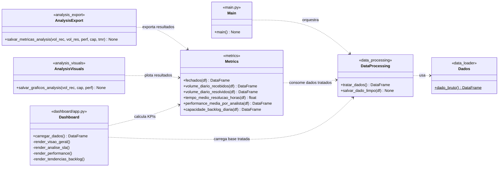

# Diagrama de Classes — Projeto Capacidade Operacional

Representa a arquitetura do código-fonte (`src/`, `main.py`, `dashboard/app.py`).
O projeto segue uma organização em **camadas / pipeline de dados**:
**Carga → Tratamento (ETL) → Métricas → Exportação/Visualização → Apresentação (Dashboard)**.

## Descrição das classes/módulos

| Classe / Módulo | Responsabilidade | Arquivo |
|-----------------|------------------|---------|
| **Dados** | Camada de **carga**: lê o CSV bruto e devolve um DataFrame. | `src/data_loader.py` |
| **DataProcessing** | Camada de **ETL**: renomeia/traduz colunas, remove campos irrelevantes, converte datas e calcula `tempo_resolucao_horas`. | `src/data_processing.py` |
| **Metrics** | Camada de **cálculo**: volume recebido/resolvido, TMR, performance por analista e saldo de backlog. | `src/metrics.py` |
| **AnalysisExport** | **Exportação** das métricas para arquivos CSV/TXT em `/analysis`. | `src/analysis_export.py` |
| **AnalysisVisuals** | Geração de **gráficos estáticos** (matplotlib) em `/analysis`. | `src/analysis_visuals.py` |
| **Main** | **Orquestrador** do pipeline de tratamento. | `main.py` |
| **Dashboard** | **Apresentação**: app web Streamlit + Plotly com 4 abas e filtros globais. | `dashboard/app.py` |

> **Notas de notação:** `+` público, `-` privado, `$` método estático (`Dados.dado_bruto`).
> As setas tracejadas (`..>`) representam **dependência** (uma classe usa outra), padrão
> adequado a um projeto Python organizado por módulos funcionais.
