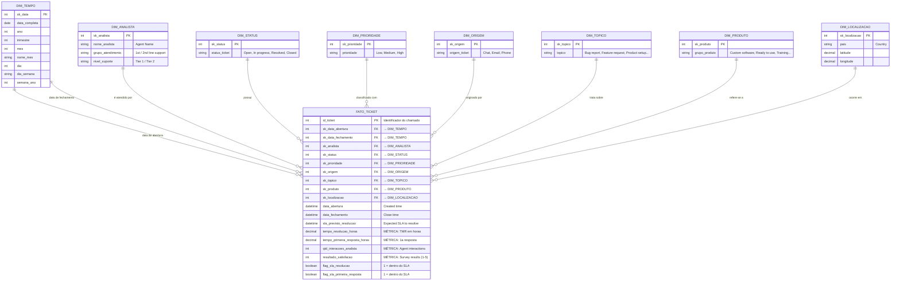

# Modelo de Dados (MER) — Projeto Capacidade Operacional

> Projeto de **Business Intelligence / Análise de Dados** sobre a base **Technical Support Dataset**
> (~2.330 tickets de uma equipe de suporte técnico).

Como se trata de um projeto de BI, o modelo de dados foi desenhado como um
**modelo dimensional (Esquema Estrela / Star Schema)**: uma tabela **Fato** no centro,
contendo as métricas mensuráveis (tempo de resolução, SLA, satisfação), cercada por
**tabelas Dimensão**, que guardam os atributos descritivos usados para filtrar e agrupar
as análises do dashboard.

- **Grão (grain) da Fato:** 1 linha = 1 ticket de suporte.
- **Origem dos dados:** `data/bruto/Technical Support Dataset.csv` → tratado em `data/tratado/`.

---

## Diagrama Entidade-Relacionamento (Esquema Estrela)

> **Como visualizar:** o GitHub renderiza este diagrama automaticamente ao abrir o arquivo.
> Para exportar como imagem (para slides), cole o bloco acima em <https://mermaid.live> e use *Export → PNG/SVG*.

---

## Entidades, chaves e cardinalidades

| Entidade | Tipo | Chave Primária | Papel no modelo |
|----------|------|----------------|-----------------|
| **FATO_TICKET** | Fato | `id_ticket` | Guarda 1 registro por chamado e todas as métricas operacionais. |
| **DIM_TEMPO** | Dimensão | `sk_data` | Calendário; ligada 2x à Fato (abertura e fechamento — *role-playing*). |
| **DIM_ANALISTA** | Dimensão | `sk_analista` | Analista + grupo de atendimento + nível de suporte. |
| **DIM_STATUS** | Dimensão | `sk_status` | Situação atual do chamado. |
| **DIM_PRIORIDADE** | Dimensão | `sk_prioridade` | Criticidade do chamado. |
| **DIM_ORIGEM** | Dimensão | `sk_origem` | Canal de entrada da solicitação. |
| **DIM_TOPICO** | Dimensão | `sk_topico` | Assunto do chamado. |
| **DIM_PRODUTO** | Dimensão | `sk_produto` | Grupo de produto relacionado. |
| **DIM_LOCALIZACAO** | Dimensão | `sk_localizacao` | País/coordenadas do cliente. |

### Relacionamentos (cardinalidade)

Todos os relacionamentos são **1:N** (um-para-muitos) — padrão do esquema estrela:

- Uma **Dimensão** descreve **muitos** registros da Fato; cada registro da Fato aponta para **uma** ocorrência de cada Dimensão.
- Notação do diagrama: `||--o{` → "um e somente um" (lado dimensão) para "zero ou muitos" (lado fato).

| Relacionamento | Cardinalidade |
|----------------|---------------|
| DIM_ANALISTA → FATO_TICKET | 1 analista atende N tickets |
| DIM_TEMPO → FATO_TICKET (abertura) | 1 data abre N tickets |
| DIM_TEMPO → FATO_TICKET (fechamento) | 1 data fecha N tickets |
| DIM_PRIORIDADE → FATO_TICKET | 1 prioridade classifica N tickets |
| DIM_STATUS → FATO_TICKET | 1 status descreve N tickets |
| DIM_ORIGEM → FATO_TICKET | 1 canal origina N tickets |
| DIM_TOPICO → FATO_TICKET | 1 tópico agrupa N tickets |
| DIM_PRODUTO → FATO_TICKET | 1 produto relaciona N tickets |
| DIM_LOCALIZACAO → FATO_TICKET | 1 local concentra N tickets |

---

## De onde vem cada campo (rastreabilidade)

| Coluna original (bruto) | Destino no modelo |
|-------------------------|-------------------|
| `Ticket ID` | FATO_TICKET.id_ticket (PK) |
| `Created time` | FATO_TICKET.data_abertura → DIM_TEMPO |
| `Close time` | FATO_TICKET.data_fechamento → DIM_TEMPO |
| `Resolution time` / cálculo | FATO_TICKET.tempo_resolucao_horas |
| `First response time` | FATO_TICKET.tempo_primeira_resposta_horas |
| `Agent interactions` | FATO_TICKET.qtd_interacoes_analista |
| `Survey results` | FATO_TICKET.resultado_satisfacao |
| `SLA For Resolution` | FATO_TICKET.flag_sla_resolucao |
| `SLA For first response` | FATO_TICKET.flag_sla_primeira_resposta |
| `Agent Name` + `Agent Group` + `Support Level` | DIM_ANALISTA |
| `Status` | DIM_STATUS |
| `Priority` | DIM_PRIORIDADE |
| `Source` | DIM_ORIGEM |
| `Topic` | DIM_TOPICO |
| `Product group` | DIM_PRODUTO |
| `Country` / `Latitude` / `Longitude` | DIM_LOCALIZACAO |

---

## Observação metodológica

A base original é uma **tabela única (flat table)**. O modelo acima representa a **modelagem
dimensional** aplicada para fins de BI: a separação em Fato + Dimensões é o que permite os
filtros globais e os cruzamentos (por analista, prioridade, período, canal etc.) usados no
dashboard Streamlit e no relatório Power BI do projeto.
